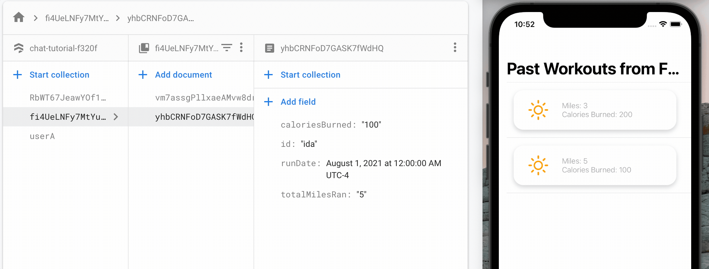

# runningLog Personal Project
* Once quarintine started, I started getting into running
* Started off with the Strava App, however, I wanted an quick and easy way to log all of my runs 
* Also wanted a comments/notes section to jot down my thoughts during that run. 
* For example, there were many times where I realized that my form was off and wanted to jot down my mistake
* Went from Strava to the notes app for this reason, but wanted a more robust option
* Hence - __runninglog (tentative name, trying to think of cool names at the moment)__ 
* Vision is to create something clean and simple - one tab to see past runs and all of its meta info, and another to log the current run

## A Full Run Through updated on August 6th, 2021

## Firebase Run Through 
* Here, I wanted to show that I added firebase integration. Users will create documents per run, which are then populated with the given meta data (i.e totalMilesRan, etc)
* User UID is based on email during sign up, and corresponding data is dynamically fetched
* The goal is to import the whole "Past Workouts" View under the "Logs" tab, into the firebase tab
* 

| Item  |Priority (**1**>2>3)   | Description/Comments
|---|---|---|
| Add Firebase Auth and Read/Write |   1 | Would not want user data to be lost. Personally have running data across multiple sources (i.e Strava, Nike Running Club, Notes App), but would rather have one centralized location for all that data|
| Push Beta on TestFlight. If you want to be a beta user, please reach out to me at aar233@cornell.edu  | 2  | Want to do beta testing to catch bugs and get general feedback|
| Badges  |  3 | A cool reward system. Perhaps if you ran a new PR Time or PR Distance, you can get badges/trophies. Goal is to have badges/trophies show on specific runs on the past run Log. Was also thinking of a streaks system like snapchat|
